# Automation Rules & Best Practices

This document outlines the automation rules, labeling strategy, and workflow automation implemented in this project to demonstrate modern DevOps practices.

## 🏷️ GitHub Labels Strategy

### Priority Labels
```
🔴 priority: critical    - Must be fixed immediately
🟠 priority: high       - Should be addressed soon
🟡 priority: medium     - Normal priority
🟢 priority: low        - Can wait
```

### Type Labels
```
🐛 bug                  - Something isn't working
✨ enhancement          - New feature or request
📚 documentation       - Documentation improvements
🎨 design              - UI/UX changes
♻️ refactoring         - Code improvements (no feature change)
⚡ performance         - Performance improvements
🔒 security           - Security-related changes
🧪 testing            - Test-related changes
```

### Status Labels
```
🚀 ready for review    - PR is ready for review
🔄 in progress        - Work is ongoing
⏸️ blocked            - Waiting on dependencies
🎯 needs testing      - Requires testing before merge
📋 needs discussion   - Requires team discussion
```

### Jira Integration Labels
```
📌 jira: linked       - Automatically added when Jira reference found
⚠️ jira: missing      - No Jira reference (triggers workflow failure)
```

## 🤖 Automated Workflows

### 1. Jira Issue Linking

**Trigger:** PR opened
**Actions:**
- Extract Jira key from branch/title/description
- Validate Jira reference exists
- Add comment to PR with Jira link
- Add comment to Jira with PR link
- Transition Jira issue to "In Review"
- Apply `jira: linked` label

**Code Location:** `.github/workflows/jira-integration.yml`

### 2. PR Status Sync

**Trigger:** PR status changes
**Actions:**

| PR Event | Jira Transition | GitHub Label |
|----------|----------------|--------------|
| Opened | → In Review | `ready for review` |
| Merged | → Done | Remove all status labels |
| Closed (not merged) | → Cancelled | `blocked` |
| Reopened | → In Progress | `in progress` |

### 3. Smart Commit Processing

**Trigger:** Push to main/develop
**Actions:**
- Parse commit messages for smart commit syntax
- Log time to Jira issues
- Add comments to Jira
- Transition issues based on commit commands

**Examples:**
```bash
# Log time
PROJ-123 #time 2h 30m Implemented user login

# Add comment
PROJ-456 #comment Fixed validation bug in email field

# Close issue
PROJ-789 #close Completed feature testing and deployment

# Multiple actions
PROJ-123 #time 1h #comment Added error handling #transition Done
```

### 4. PR Validation

**Trigger:** PR opened/edited
**Checks:**
- ✅ Jira reference exists
- ✅ PR title follows convention
- ✅ Description is not empty
- ✅ Checklist items addressed
- ✅ Labels applied

**Failure Actions:**
- Block merge
- Add `jira: missing` label
- Comment on PR with requirements

### 5. Auto-Labeling

**Trigger:** PR opened
**Rules:**
- Branch name contains `feature/` → Add `enhancement`
- Branch name contains `bugfix/` → Add `bug`
- Branch name contains `hotfix/` → Add `bug` + `priority: high`
- Files changed in `/docs/` → Add `documentation`
- Files changed in `*.test.*` → Add `testing`

## 🔄 Jira Automation Rules

### Rule 1: Auto-assign on PR Link
```
WHEN: GitHub PR link added to issue
THEN: Assign issue to PR author
```

### Rule 2: Notify on In Review
```
WHEN: Issue transitions to "In Review"
THEN: Send Slack notification to #code-review channel
      Add watcher: Tech Lead
```

### Rule 3: Auto-close on PR Merge
```
WHEN: GitHub PR marked as merged
THEN: Transition issue to "Done"
      Add comment with deployment details
```

### Rule 4: Flag Stale Reviews
```
WHEN: Issue in "In Review" for > 2 days
THEN: Add label: "Review Needed"
      Mention reviewer in comment
```

### Rule 5: Track Cycle Time
```
WHEN: Issue transitions to "Done"
THEN: Calculate time from "In Progress" to "Done"
      Update custom field: "Cycle Time"
      Log to analytics dashboard
```

## 📊 Workflow Diagram

```mermaid
graph TD
    A[Developer Creates Branch] -->|feature/PROJ-123-name| B[Commits with Smart Syntax]
    B -->|PROJ-123 #time 2h| C[Time Logged in Jira]
    B --> D[Opens Pull Request]
    D --> E{Jira Reference?}
    E -->|No| F[Workflow Fails]
    E -->|Yes| G[Jira → In Review]
    G --> H[Auto-assign Labels]
    H --> I[Code Review]
    I --> J{Approved?}
    J -->|No| K[Request Changes]
    K --> I
    J -->|Yes| L[Merge PR]
    L --> M[Jira → Done]
    M --> N[Deploy to Production]
```



## 🎯 Advanced Automation Ideas

### Integration Extensions

**1. Slack Integration**
```yaml
- PR opened → Notify #code-review
- PR merged → Notify #deployments
- Build fails → Notify PR author
- Deployment complete → Notify #team-updates
```

**2. Deployment Automation**
```yaml
- Merge to main → Auto-deploy to staging
- Tag created → Deploy to production
- Rollback command → Revert to previous version
```

**3. Release Notes Generation**
```yaml
- On tag creation → Extract all Jira issues since last tag
- Generate release notes from Jira summaries
- Post to Confluence
- Notify stakeholders
```

**4. Code Quality Gates**
```yaml
- Run linting on PR
- Check test coverage (require 80%+)
- Security scan (Snyk/Dependabot)
- Performance benchmarks
- Block merge if any check fails
```

## 📈 Metrics to Track

### Development Metrics
- Average PR review time
- Deployment frequency
- Lead time (Jira created → Deployed)
- Cycle time (In Progress → Done)
- Change failure rate

### Code Quality Metrics
- Test coverage percentage
- Linting warnings/errors
- Security vulnerabilities
- Code duplication percentage
- Technical debt ratio

## 🎓 Interview Discussion Points

### Question: "How would you improve team efficiency?"

**Answer using this project:**
> "I implemented comprehensive automation between Jira and GitHub. This includes:
>
> 1. **Automatic Status Updates**: When PRs are opened, Jira tickets automatically transition to 'In Review', saving ~5 minutes per PR
>
> 2. **Smart Commits**: Developers can log time and update tickets directly from commit messages, eliminating context switching
>
> 3. **Enforced Standards**: Automated validation ensures all PRs reference Jira issues, improving traceability
>
> 4. **Metrics Collection**: Automated tracking of cycle time and deployment frequency helps identify bottlenecks
>
> In a team of 5 developers, this could save approximately 2-3 hours per week per developer."

### Question: "Describe your experience with CI/CD"

**Answer using this project:**
> "I've implemented GitHub Actions workflows for Jira integration, which demonstrates several CI/CD concepts:
>
> - **Pipeline Automation**: Workflows trigger on events (push, PR, merge)
> - **Quality Gates**: PR validation prevents merges without Jira references
> - **Integration Testing**: Workflows verify API connectivity before processing
> - **Deployment Readiness**: Smart commits and automated transitions ensure issues are tracked through deployment
>
> I've also designed this to be extensible - we could easily add deployment steps, security scanning, or performance testing to the workflow."

### Question: "How do you ensure code quality?"

**Answer using this project:**
> "I use a multi-layered approach:
>
> 1. **Automated Checks**: GitHub Actions validate PR requirements
> 2. **Template Enforcement**: PR templates ensure consistent documentation
> 3. **Traceability**: Mandatory Jira references link code to requirements
> 4. **Review Process**: Automated transitions notify reviewers when PRs are ready
> 5. **Labeling Strategy**: Auto-labeling helps prioritize and categorize changes
>
> This creates accountability and makes it easy to audit why changes were made."

## 🛠️ Setup Checklist

For a complete demo environment:

- [ ] Create Jira free trial account
- [ ] Set up sample project in Jira
- [ ] Configure GitHub repository secrets
- [ ] Test workflow with sample PR
- [ ] Create example smart commits
- [ ] Document the flow in README
- [ ] Prepare talking points for interview
- [ ] Create sample issues and PRs to demonstrate
- [ ] Test full workflow end-to-end
- [ ] Prepare to explain technical decisions

## 📚 Additional Resources

- [GitHub Actions Best Practices](https://docs.github.com/en/actions/learn-github-actions/best-practices-for-workflows)
- [Jira Automation Rules](https://support.atlassian.com/cloud-automation/docs/jira-automation/)
- [DevOps Metrics Guide](https://www.atlassian.com/devops/frameworks/devops-metrics)
- [DORA Metrics](https://cloud.google.com/blog/products/devops-sre/using-the-four-keys-to-measure-your-devops-performance)
