# ISO Compliance Workflow - Plastics Manufacturing

## Demonstrating UX/BA Skills for ISO Management Software

This document shows workflow design and process simplification for ISO compliance in a plastics manufacturing context—directly relevant to EmmersonWills' ISO simplification mission.

---

## Scenario: Injection Moulding Company

**Company Profile:**
- Medium-sized plastics manufacturer (50-100 employees)
- Injection moulding operations
- ISO 9001 (Quality), ISO 14001 (Environmental), ISO 45001 (H&S)
- Multiple production lines, 20+ moulds
- Annual certification audits

**Challenge:** Manual ISO compliance is overwhelming, time-consuming, and error-prone.

---

## 🎯 User Personas

### 1. Sarah - Production Operator
- **Role:** Injection moulding machine operator
- **Pain Points:** Paperwork interrupts production, can't remember all quality checks, handwriting illegible
- **Goals:** Get production done, avoid quality issues, go home on time
- **Tech Comfort:** Low (prefers simplicity)

### 2. Mike - Quality Manager
- **Role:** ISO compliance owner, prepares for audits
- **Pain Points:** Chasing missing paperwork, can't find evidence, audit panic mode
- **Goals:** Pass audits first time, prove compliance easily, reduce admin time
- **Tech Comfort:** Medium

### 3. Emma - HSE Coordinator
- **Role:** Health, Safety & Environment officer
- **Pain Points:** Incident reports incomplete, training records outdated, spreadsheet chaos
- **Goals:** Zero accidents, regulatory compliance, proactive risk management
- **Tech Comfort:** Medium-High

### 4. David - External Auditor
- **Role:** BSI/UKAS certification auditor
- **Pain Points:** Waiting for evidence, inconsistent documentation, wasted time
- **Goals:** Complete audit efficiently, verify compliance objectively
- **Tech Comfort:** High

---

## 📊 Workflow 1: Production Quality Check (ISO 9001)

### Before Automation (Current State - Manual)

**Problems:**
- ❌ 12+ manual steps per production run
- ❌ Forms get lost or damaged
- ❌ Handwriting illegible
- ❌ Data entry errors (~15%)
- ❌ Evidence scattered across filing cabinets
- ❌ Audit panic: "Where's the paperwork for batch X?"
- ❌ Time: 15-20 minutes per check

---

### After Automation (Future State - Simplified)

**Benefits:**
- ✅ 5 steps (down from 12)
- ✅ Digital forms always available
- ✅ Auto-validation catches errors immediately
- ✅ Cloud storage - never lose evidence
- ✅ Searchable, filterable data
- ✅ Audit-ready instantly
- ✅ Time: 3-5 minutes per check (75% reduction)

---

## 📊 Workflow 2: Environmental Waste Tracking (ISO 14001)

### Swimlane Diagram - Multi-Actor Process

**Key Features:**
- **Operator Lane (Blue):** Simple data entry at point of waste creation
- **System Lane (Green):** Automated calculations and alerts
- **HSE Lane (Yellow):** Proactive management when thresholds exceeded
- **Auditor Lane (Purple):** Self-service evidence access

---

## 📊 Workflow 3: Health & Safety Incident Management (ISO 45001)

### Sequence Diagram - Actor Interactions Over Time

```mermaid
sequenceDiagram
    participant Op as Operator
    participant Mobile as Mobile App
    participant System as ISO System
    participant HSE as HSE Coordinator
    participant Manager as Line Manager
    participant Auditor as External Auditor

    Note over Op,Mobile: Incident Occurs
    Op->>Mobile: Report incident (photo, details)
    Mobile->>System: Submit incident report
    System->>HSE: Immediate notification
    System->>Manager: Immediate notification

    Note over HSE,Manager: Investigation Phase
    HSE->>System: Access incident details
    HSE->>Op: Request additional info
    Op->>System: Provide witness statement
    Manager->>System: Add corrective actions

    Note over System: Automated Compliance
    System->>System: Create action tracker
    System->>System: Schedule follow-ups
    System->>System: Link to risk assessment

    Note over Manager: Action Implementation
    Manager->>System: Update action status
    System->>HSE: Progress notification
    HSE->>System: Verify completion
    System->>System: Close incident

    Note over Auditor: Audit Phase (6 months later)
    Auditor->>System: Request incident records
    System->>Auditor: Provide complete trail
    Auditor->>Auditor: Verify corrective actions
    Note over Auditor: Compliance verified ✓
```

**Demonstrating:**
- Real-time notifications across multiple roles
- Mobile-first design (operators use phones, not desktops)
- Automated workflow progression
- Complete audit trail maintained automatically
- Self-service for auditors

---

## 📊 Workflow 4: Audit Preparation Process

### State Transition Diagram

**ISO Simplification Features:**
- **Automated reminders** - No more audit panic
- **Self-audit validation** - Find issues before auditor does
- **Evidence pre-staging** - Everything auditor needs, organized
- **Action tracking** - Close findings systematically

---

## 📊 Workflow 5: Document Control & Version Management

### Before/After Comparison - ISO 9001 Requirement

#### Before (Manual Document Control)

**Problems:**
- Version control nightmare
- Employees using outdated procedures
- Audit findings: "Obsolete documents in use"
- QM spends hours answering "which version is current?"

---

#### After (Digital Document Control)

**Benefits:**
- ✅ Single source of truth
- ✅ Always current version
- ✅ Automatic version control
- ✅ Who accessed what, when (audit trail)
- ✅ Zero paper documents
- ✅ Mobile access from production floor

---

## 📊 Workflow 6: Client Portal - Auditor Self-Service

### Decision Flow - Auditor Experience

**Auditor Benefits:**
- Self-service access (no waiting for client to "find" evidence)
- Pre-audit document review (audit day is verification, not discovery)
- Filtered, searchable evidence
- Export functionality for audit reports
- Random sampling tools

**Client Benefits:**
- Less disruption during audit (auditor can pre-review)
- Professional presentation of evidence
- Faster audit completion
- Better audit outcomes

---

## 📊 Business Impact Metrics

### Time Savings Analysis

| Activity | Manual (Before) | Automated (After) | Time Saved | Annual Impact* |
|----------|----------------|-------------------|------------|----------------|
| **Quality Checks** | 15 min/check | 4 min/check | 73% | 458 hours |
| **Incident Reports** | 45 min/incident | 10 min/incident | 78% | 175 hours |
| **Waste Logging** | 10 min/entry | 2 min/entry | 80% | 200 hours |
| **Document Retrieval** | 12 min/search | 30 sec/search | 96% | 287 hours |
| **Audit Preparation** | 80 hours | 8 hours | 90% | 72 hours |
| **NCR Management** | 3 hours/NCR | 30 min/NCR | 83% | 200 hours |
| **Training Records** | 20 min/update | 3 min/update | 85% | 170 hours |
| **TOTAL ANNUAL SAVINGS** | | | **84%** | **1,562 hours** |

*Based on typical medium-sized plastics manufacturer (50-100 employees)

**ROI Calculation:**
- Time saved: 1,562 hours/year
- Average hourly rate: £25
- **Annual savings: £39,050**
- Software cost: ~£8,000/year
- **Net benefit: £31,050/year**
- **ROI: 388%**

---

## 🎯 UX/BA Skills Demonstrated

### In This Document:

✅ **User Persona Development** - 4 distinct personas with different needs
✅ **Journey Mapping** - Before/after user experiences
✅ **Process Flow Design** - 6 different workflow visualizations
✅ **Swimlane Diagrams** - Multi-actor process coordination
✅ **Sequence Diagrams** - Time-based interactions
✅ **State Diagrams** - Process lifecycle management
✅ **Decision Trees** - Complex logic visualization
✅ **Stakeholder Analysis** - Operators, managers, coordinators, auditors
✅ **Requirements Gathering** - ISO compliance mapped to software features
✅ **Metrics & ROI** - Quantified business impact
✅ **Domain Understanding** - ISO 9001/14001/45001 in manufacturing context

---

## 💼 Relevance to EmmersonWills

### How This Applies:

**Your Mission:** "ISO Simplification Experts"

**This Portfolio Shows:**
1. **Deep understanding** of ISO pain points (manual processes, lost evidence, audit stress)
2. **User empathy** across multiple personas (operators to auditors)
3. **Process improvement thinking** (84% time savings, 388% ROI)
4. **Visual communication** (complex processes made simple through diagrams)
5. **Domain knowledge** (ISO 9001/14001/45001 requirements in manufacturing)

**Interview Talking Point:**
> "I created these ISO compliance workflows to demonstrate how I'd approach simplification for your clients. The 'before' diagrams show the pain points I've observed in manual compliance systems. The 'after' diagrams show how thoughtful UX design can make ISO certification feel manageable rather than overwhelming—exactly what EmmersonWills delivers."

---

## 📚 ISO Standards Referenced

### Specific Clauses Addressed:

**ISO 9001:2015 (Quality Management)**
- Clause 8.5.1 - Control of production and service provision
- Clause 8.7 - Control of nonconforming outputs
- Clause 7.5 - Documented information
- Clause 9.1 - Monitoring, measurement, analysis and evaluation

**ISO 14001:2015 (Environmental Management)**
- Clause 8.1 - Operational planning and control
- Clause 9.1.1 - Monitoring, measurement, analysis and evaluation

**ISO 45001:2018 (Occupational Health & Safety)**
- Clause 10.2 - Incident, nonconformity and corrective action
- Clause 7.3 - Awareness
- Clause 9.1 - Monitoring, measurement, analysis and performance evaluation

---

**This document demonstrates the exact UX/BA capabilities EmmersonWills needs to continue wowing their growing client base in ISO simplification.** 🎯
