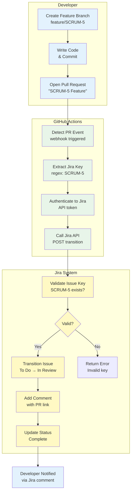
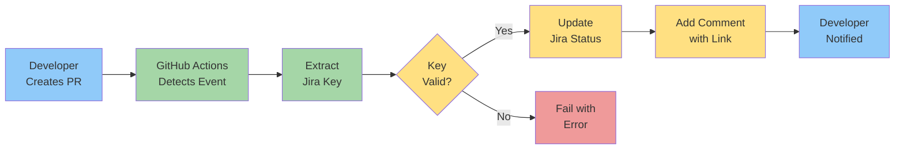
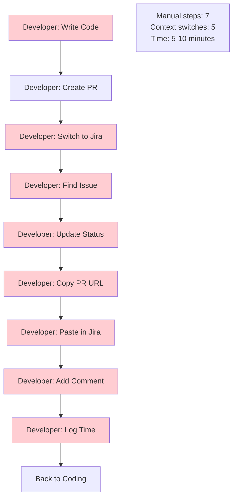
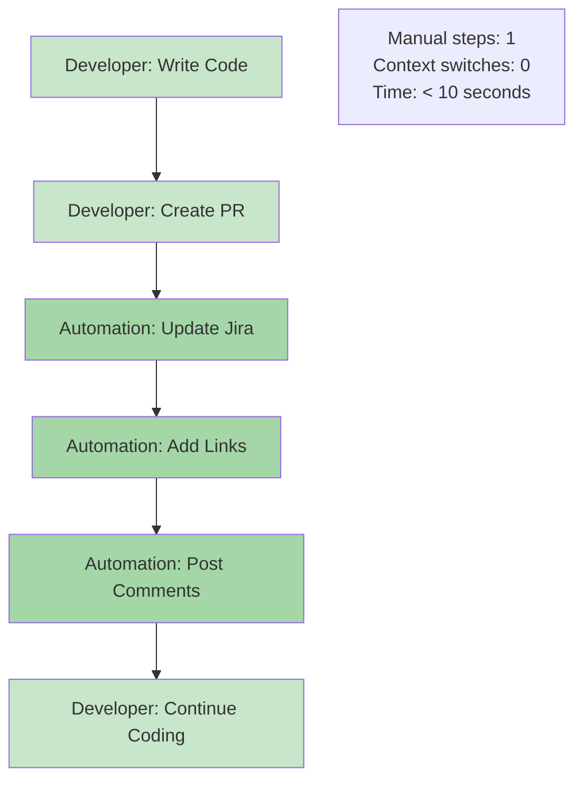
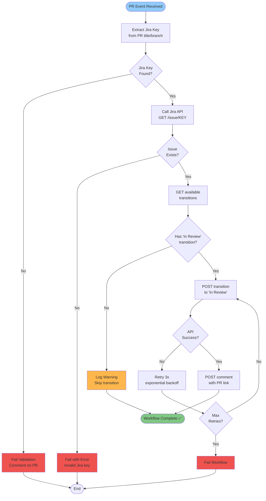

# GitHub PR to Jira Integration - Visual Workflow

## Swimlane Diagram

This diagram shows the automated workflow when a developer creates a Pull Request.

---

## Process Flow (Simplified)

---

## Sequence Diagram (Actor Interactions)

---

## State Transition Diagram

---

## Before/After Comparison

### Before Automation (Manual Process)

### After Automation (Automated Process)

---

## Decision Logic Flow

---

## Benefits Summary

| Metric | Before | After | Improvement |
|--------|--------|-------|-------------|
| **Manual Steps** | 7 steps | 1 step | -86% |
| **Context Switches** | 5 per PR | 0 per PR | -100% |
| **Time per PR** | 5-10 min | <10 sec | -95% |
| **Errors** | ~30% forgotten | 0% | -100% |
| **Visibility** | 2-3 days lag | Real-time | Instant |

---

## Usage Instructions

### View in VS Code:
1. Open this file in VS Code
2. Press `Cmd+Shift+V` (or click preview icon)
3. Diagrams render automatically!

### View on GitHub:
- Just push this file - GitHub automatically renders Mermaid diagrams
- No export needed!

### Edit Diagrams:
- Just edit the text between \`\`\`mermaid and \`\`\`
- Preview updates live in VS Code

---

**This demonstrates:**
- ✅ Visual workflow design
- ✅ Process mapping (swimlanes, sequences, state machines)
- ✅ Before/after analysis
- ✅ Decision logic and error handling
- ✅ Technical documentation skills
